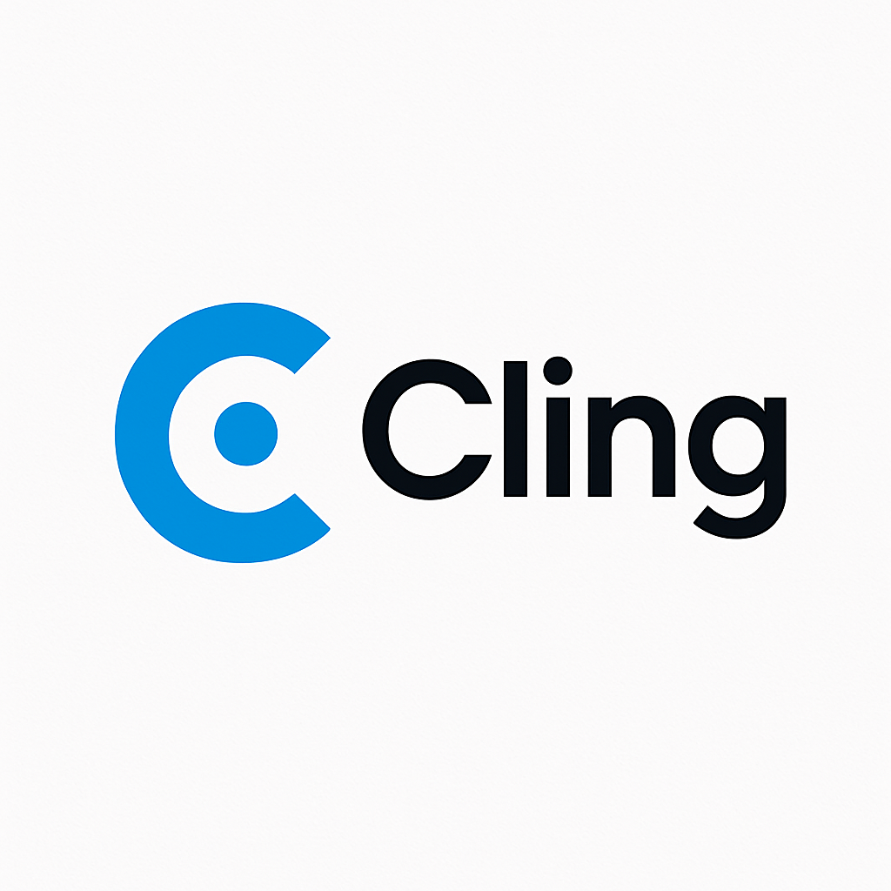

# Cling - Customer Churn Prediction App

Cling is a data-driven web application that helps businesses predict customer churn using machine learning. Built with Flask and Plotly, it offers intuitive data visualization, secure user authentication, and actionable insights.



---

## 🚀 Features

- 📂 Upload customer data (CSV)
- 🧠 ML model predicts churn probabilities
- 📊 Interactive dashboard with filters and graphs
- 🗂️ Action tracker to log retention steps
- 📝 Feedback collection system
- 🔐 User login/signup with secure session handling
- 📈 Visualizations: Pie, Bar, Histogram, Scatter plots

---

## 🖥️ Tech Stack

- **Backend:** Python, Flask, SQLite
- **Frontend:** HTML, CSS (Bootstrap), JS, Plotly.js
- **ML Model:** Random Forest (via scikit-learn)
- **Data Handling:** Pandas

---

## 📦 Installation

### 1. Clone the Repository

```bash
git clone https://github.com/your-username/cling-churn-prediction.git
cd cling-churn-prediction
2. Create Virtual Environment (optional but recommended)
bash
Copy
Edit
python -m venv .venv
source .venv/bin/activate   # macOS/Linux
# .venv\Scripts\activate     # Windows
3. Install Dependencies
bash
Copy
Edit
pip install -r requirements.txt
4. Setup Database and Default User
bash
Copy
Edit
python backend/setup_db.py
Default login: admin / password

▶️ Run the App
bash
Copy
Edit
python backend/app.py
App will be available at:
http://127.0.0.1:5000

🧪 Testing
Upload a sample test_customers.csv file with this format:

csv
Copy
Edit
id,name,tenure,charges
1,John Doe,12,89.5
2,Jane Smith,24,65.3
...
📁 Project Structure
cpp
Copy
Edit
Cling/
├── backend/
│   ├── app.py
│   ├── setup_db.py
│   ├── users.db
│   ├── model.pkl
├── frontend/
│   ├── templates/
│   ├── static/
│   ├── *.html, *.js
├── requirements.txt
├── README.md
└── .gitignore
✅ Future Ideas
Email notifications for churn risk

Admin view of all user actions

Upload history per user

🙋‍♂️ Author
Pratham Nigam
B.Tech, 2nd Year – DBMS Project
Feel free to reach out or connect on LinkedIn

📝 License
This project is for academic purposes. You may modify or use it with attribution.

yaml
Copy
Edit

---

### 📌 To use it:

1. Create a file:  
```bash
touch README.md
