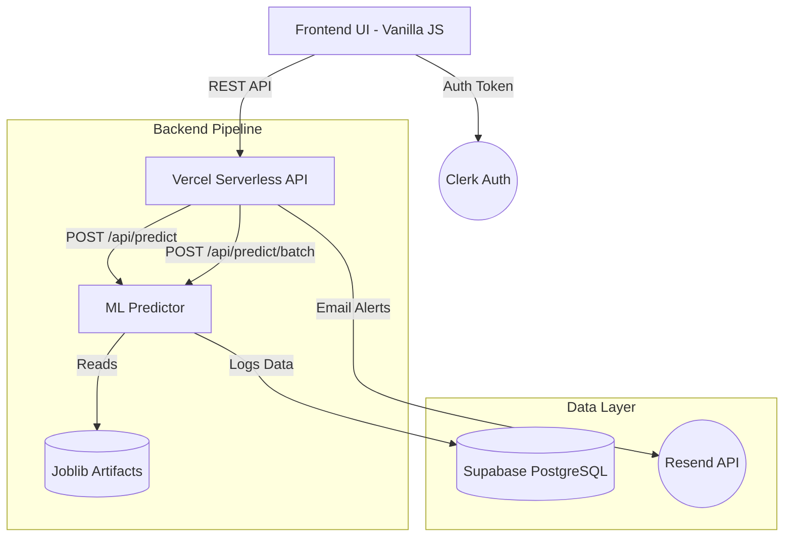

# Cling - AI Customer Churn Intelligence Platform

[](https://cling-churn-prediction.vercel.app)
[](https://github.com/SlammerStar/cling-churn-prediction/actions)
[](https://www.python.org/downloads/release/python-3110/)
[](https://opensource.org/licenses/MIT)

Cling is a production-grade, full-stack Machine Learning application designed to predict and analyze customer churn. It leverages advanced ensemble modeling (Stacking XGBoost & Random Forest), SHAP explainability, and a modern glassmorphism UI deployed entirely on serverless architecture.

## Key Features

*   **Real-time Inference API:** High-performance REST APIs hosted on Vercel Serverless Functions.
*   **Ensemble ML Engine:** Stacking classifier with Optuna hyperparameter tuning and SMOTE handling class imbalance. Calibrated probabilities for accurate risk scoring.
*   **Explainable AI (XAI):** SHAP-inspired feature impact visualization for every single prediction.
*   **Batch Analyzer:** Upload CSVs for bulk churn prediction with interactive summary reports and email alerts.
*   **Modern UI:** A beautiful, responsive, glassmorphism dashboard built with Vanilla JS and Chart.js.
*   **Database Integration:** Tracks prediction history via Supabase (PostgreSQL).
*   **Authentication:** Secured with Clerk Auth for personal history tracking.

---

## Architecture


```mermaid
graph TD
    UI[Frontend UI - Vanilla JS] -->|Auth Token| Clerk((Clerk Auth))
    UI -->|REST API| Vercel[Vercel Serverless API]
    
    subgraph Backend Pipeline
    Vercel -->|POST /api/predict| Predictor[ML Predictor]
    Vercel -->|POST /api/predict/batch| Predictor
    Predictor -->|Reads| Artifacts[(Joblib Artifacts)]
    end
    
    subgraph Data Layer
    Predictor -->|Logs Data| Supabase[(Supabase PostgreSQL)]
    Vercel -->|Email Alerts| Resend((Resend API))
    end
```

## ML Methodology & Performance

We use the Telco Customer Churn dataset.

### Pipeline
1.  **Feature Engineering:** Charge-to-tenure ratio, Service bundle scores, Contract risk indexing, and interaction terms.
2.  **Balancing:** `SMOTE` is applied to address churn class imbalance.
3.  **Modeling:** Base models (`RandomForest` optimized via `Optuna`, `LogisticRegression`) are stacked using a `StackingClassifier` and probabilities are calibrated using `CalibratedClassifierCV`.

### Benchmarks (Holdout Test Set)

| Model | Test AUC | CV AUC | F1 Score | Accuracy |
| :--- | :--- | :--- | :--- | :--- |
| **Logistic Regression** | **0.8433** | 0.8555 | 0.6194 | 0.7480 |
| Random Forest | 0.8366 | 0.9133 | 0.6227 | 0.7587 |
| XGBoost | 0.8428 | 0.9357 | 0.5979 | 0.7629 |

---

## Quick Start (Local Setup)

### Option 1: Docker (Recommended)

1. Clone the repository:
   ```bash
   git clone https://github.com/SlammerStar/cling-churn-prediction.git
   cd cling-churn-prediction
   ```
2. Create a `.env` file (Optional for DB/Email):
   ```env
   SUPABASE_URL=your_url
   SUPABASE_KEY=your_key
   RESEND_API_KEY=your_key
   ALERT_EMAIL=you@example.com
   ```
3. Run with Docker Compose:
   ```bash
   docker-compose up --build
   ```
4. Open `http://localhost:5002` in your browser.

### Option 2: Manual Python Environment

```bash
python -m venv .venv
source .venv/bin/activate
pip install -r requirements-dev.txt

# Train the model to generate artifacts
python ml/train.py

# Run the local server
python local_app.py
```

---

## Deployment (Vercel)

This project is optimized for **Vercel**.

1. Create a GitHub repository and push your code.
2. Go to [Vercel](https://vercel.com/) and import the project.
3. Configure the **Build & Development Settings**:
   * Framework Preset: `Other`
   * Build Command: `Empty`
   * Output Directory: `Empty`
4. Add Environment Variables (`SUPABASE_URL`, `SUPABASE_KEY`, `RESEND_API_KEY`).
5. Click **Deploy**. Vercel will automatically parse `vercel.json` and deploy the Python functions in the `api/` directory.

---

## API Documentation

### `POST /api/predict`
Predict churn risk for a single customer.

**Request Body:**
```json
{
  "tenure": 12,
  "MonthlyCharges": 85.5,
  "TotalCharges": 1026.0,
  "Contract": "Month-to-month",
  "InternetService": "Fiber optic",
  ...
}
```

**Response:**
```json
{
  "churn": 1,
  "probability": 84.5,
  "risk_level": "High",
  "risk_color": "#ef4444",
  "top_features": [
    {"feature": "ContractRiskScore", "importance": 0.23},
    {"feature": "TenureGroup", "importance": 0.18}
  ],
  "model_used": "Logistic Regression"
}
```

### `POST /api/predict/batch`
Predict churn risk for a CSV batch.

**Request:** `multipart/form-data` with `file` field.

**Response:** JSON containing `churn_rate`, `risk_distribution`, and an array of individual `predictions`.

---

## Contributing

Contributions are welcome! Please open an issue or submit a pull request for any enhancements or bug fixes. Ensure you run `pytest tests/` before submitting.

## License

This project is licensed under the MIT License - see the LICENSE file for details.
